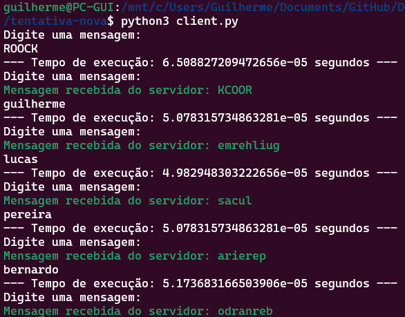

# para executar o programa em modo normalizado
## Passo 1: Execute o servidor

```bash
python3 server.py
```
## Passo 2: Execute o cliente

```bash
python3 client.py
```

## Passo 3: mande mensagens!
## Passo 4: crie outros clientes!


# para executar o programa em modo ataque DDOS

## Passo 1: Execute o servidor

```bash
python3 server.py
```

## Passo 2: Execute o cliente


```bash
python3 ddos.py
```

No modo de ataque de negação de serviço (DDOS attack)

O cliente enviará repetidamente mensagens ao servidor de modo que cria diversas conexões ao mesmo tempo, sobrecarregando o mesmo.

---

# **RELATÓRIO**

NA EXECUÇÃO DO ATAQUE DDOS, FOI CONCLUÍDO QUE O MESMO FOI EXECUTADO COM SUCESSO, CONSEGUINDO ATINGIR 100% DA CAPACIDADE DO PROCESSADOR 


